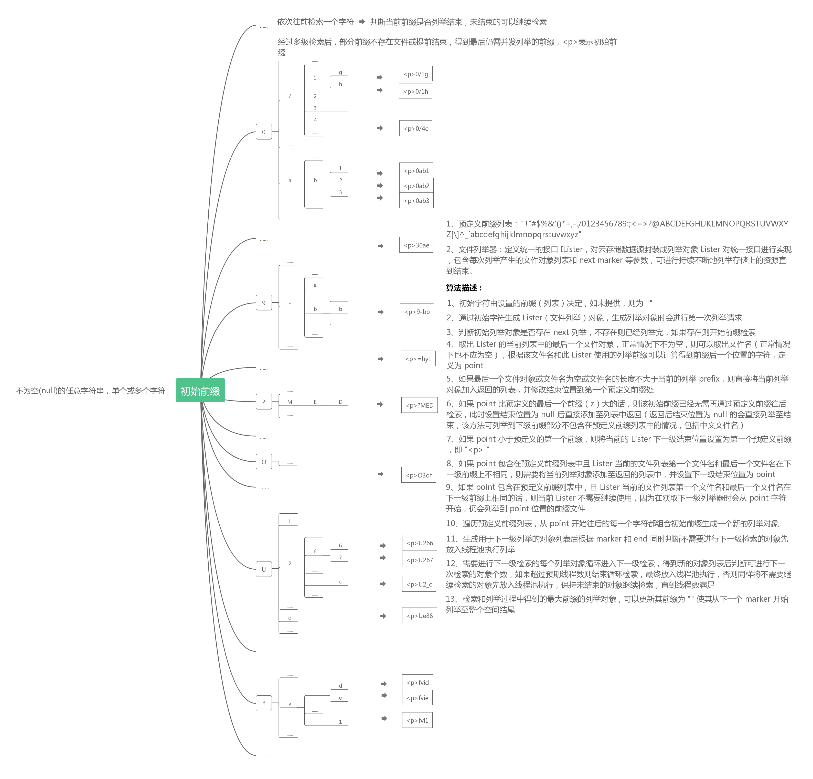

# 数据源

## 简介
从支持的数据源中读入资源信息列表，部分数据源需要指定行解析方式或所需格式分隔符，读取指定位置的字段作为输入值进行下一步处理。**目前支持的数据源类型分为
几大类型：云存储列举(storage)、文件内容读取(file)**。  

## 配置
数据源分为两种类型：云存储列举(storage)、文本文件行读取(file)，可以通过 **path= 来指定数据源地址：  
`path=qiniu://<bucket>` 表示从七牛存储空间列举出资源列表，参考[七牛数据源示例](#1-七牛云存储)  
`path=tencent://<bucket>` 表示从腾讯存储空间列举出资源列表，参考[腾讯数据源示例](#2-腾讯云存储)  
`path=aliyun://<bucket>` 表示从阿里存储空间列举出资源列表，参考[阿里数据源示例](#3-阿里云存储)  
`path=s3://<bucket>` 表示从 aws/s3 存储空间列举出资源列表，参考[S3数据源示例](#4-aws-s3)  
`path=upyun://<bucket>` 表示从又拍云存储空间列举出资源列表，参考[又拍数据源示例](#5-又拍云存储)  
`path=huawei://<bucket>` 表示从华为云存储空间列举出资源列表，参考[华为数据源示例](#6-华为云存储)  
`path=baidu://<bucket>` 表示从百度云存储空间列举出资源列表，参考[百度数据源示例](#7-百度云存储)  
`path=<filepath>` 表示从本地目录（或文件）中读取资源列表，参考[本地文件数据源示例](#8-local-files)  
未设置数据源时则默认从七牛空间进行列举**，配置文件示例可参考 [配置模板](../resources/application.config)，**数据源读取的默认保存路径使用 
\<bucket\> 名称或者 \<path\>-result 来创建目录。**  

### 1 公共参数
```
path=
unit-len=
threads=
indexes=key,etag,fsize
```  
|参数名|参数值及类型 |含义|  
|-----|-------|-----|  
|path| 数据源字符串| 选择从[云存储空间列举]还是从[本地路径文件中读取]资源列表，本地数据源时填写本地文件或者目录路径，云存储数据源时可填写"qiniu://\<bucket\>"、"tencent://\<bucket\>" 等|  
|unit-len| 整型数字| 表示一次读取的文件个数（读取或列举长度，不同数据源有不同默认值），对应与读取文件时每次处理的行数或者列举请求时设置的 limit 参数|  
|threads| 整型数| 表示预期最大线程数，若实际得到的文件数或列举前缀数小于该值时以实际数目为准|  
|indexes| 字符串列表| 资源元信息字段索引（下标），设置输入行对应的元信息字段下标|  

**备注：** indexes、unit-len、threads 均有默认值非必填，indexes 说明及默认值参考下述[ indexes 索引](#关于-indexes-索引)，unit-len 
和 threads 说明及默认值参考下述[并发处理](#关于并发处理 )，建议根据需要优化参数配置。  

#### 关于 indexes 索引 
`indexes` 是一个配置字段映射关系的参数，即规定用于从输入行中取出所需字段的索引名及映射到目标对象的字段名，程序会解析每一个键值对构成索引表，默认设置
为顺序包含 9 个字段：**key,etag,size,datetime,mime,type,status,md5,owner**，参考[文件信息字段](#关于文件信息字段)，只需要按顺序设置 
9 个字段的索引即可，如 `indexes=0,1,2,3,4,5` 表示取第一个字段为 key，取第二个字段为 etag，以此类推，**列举操作**或者**文件输入格式为 json**
时如 `indexes=key,etag,size,datetime,mime,type` 表示从依次取出 key,etag,size,datetime,mime,type 这些值，后几位不填写或者中间填写 -1
的表示不需要该部分字段，如 `key,hash,size,-1,timestamp,-1,type` 表示需要 key,hash,size,timestamp,type 这些值，而其他的不需要。  

**默认情况：**  
（1）当数据源为 [storage](#3-storage-云存储列举) 类型时，也可按照[上述 indexes 规范](#关于-indexes-索引)自行设置该参数，用于指定列举结果
的持久化或者下一步 process 操作所需要的字段，默认包含全部下标。对于 datetime 字段，实际上是根据文件对象的 putTime 或者 lastModified 时间戳转
换而来的日期时间字符串，便于了解具体时间信息，默认只能得到 datetime 信息，如果需要原本的时间戳信息，则需要在 indexes 中加入 timestamp 字段，程
序会自动识别并扩展出该字段，如 `indexes=key,etag,size,timestamp,mime,type`，此时持久化结果中或者 process 的输入行中将体现 timestamp，亦
可使两者同时存在，如 `indexes=key,etag,size,datetime,timestamp,mime,type,status,md5,owner`。  

（2）当数据源为 [file](#2-file-文本文件行读取) 类型时，默认情况下，程序只从输入行中解析 `key` 字段数据，因此当输入格式为 `tab/csv` 时索引只有
`0`，输入格式为 `json` 时索引只有 `key`，使用默认值时若存在 [filter](filter.md) 过滤字段则会自动添加过滤字段，需要指定更多字段时可按照[indexes 规范](#关于-indexes-索引)
设置，例如为数字列表:`0,1,2,3,...` 或者 `json` 的 `key` 名称列表，采用默认字段的设置方式时长度不超过 9，表明取对应顺序的前几个字段，当数据格式
为 `tab/csv` 时索引必须均为整数，如果输入行中本身只包含部分字段，则可以在缺少字段的顺序位置用 `-1` 索引表示，表示跳过该顺序对应的字段，例如原输入
行中不包含 mime 字段，则可以设置 `indexes=0,1,2,3,-1,5`。  

事实上，对于 file 数据源，`indexes` 还有一种设置方式，不需要遵循文件信息的字段，此时需要中括号 []，参数格式为 `[key1:index1,key2:index2,key3:index3,...]`，
由于命令行终端可能对该参数格式字符敏感，故可能需要加上 `"` 来设置，例如，输入行以分隔符分割得到字符串数据其中包含三个字段，分别表示<文件名>、<文件大小>、
<时间>，那么可以设置 `indexes="[key:0,size:1,datetime:2]"`，如输入行是包含 key,size,datetime 等字段的 json，则可以设置
`indexes="[key:key,size:key,datetime:datetime]"`，表示目标对象字段需要 key,size,datetime，且从输入行中进行解析的索引分别为 key,size,key,datetime。
因此 `indexes` 可以设置多个键值对，每个键值对都表示程序中字段与输入行中索引的对应关系，即 `<key>:<index>`。`<key>` 即为表示实际含义的对象字段名，
`<index>` 可以为数字或字符串，即将输入行按照一种格式解析后可以读取对象字段值的索引，为数字且输入格式为 tab/csv 时表示输入行可分隔为 value 数组，
采用数组下标的方式读取目标值，为字符串时可以是 json 行的原始字段名。    

#### 关于并发处理  
(1) 云存储数据源，从存储空间中列举文件，可多线程并发列举，用于支持大量文件的加速列举，线程数在配置文件中指定，自动按照线程数检索前缀并执行并发列举。  
(2) 本地文件数据源，unit-len 和 threads 默认值分别为 10000 和 50，从本地读取路径下的所有文本文件，一个文件进入一个线程处理，最大线程数由 threads
确定，与输入文件数之间小的值成为实际并发数，因此在需要并发时需要确保目录中存在多个不同的数据源文件。  

#### 关于文件信息字段  
文件信息规范字段及顺序定义为：**key,etag,size,datetime,mime,type,status,md5,owner** (indexes 的默认字段及顺序即使用该字段列表)，默认根
据七牛存储文件的信息字段进行定义，顺序固定，其释义及其他数据源方式对应关系如下：  

|数据源      |key（文件名）    |etag（文件唯一值）|size（文件大小 kb）|datetime（日期时间字符串）|mime（mime-type/content-type）|type（资源存储类型）|status（资源状态）|md5（文件 md5）|owner（终端标识符）|  
|-----------|---------------|---------------|-----------------|-----------------------|-----------------------------|-----------------|---------------|-------------|-----------------|  
|文件列表输入行|indexes第1个索引|indexes的第2个索引|indexes的第3个索引|indexes的第4个索引       |indexes的第5个索引             |indexes的第6个索引 |indexes的第7个索引|indexes的第8个索引|indexes的第9个索引|
|七牛云存储   |key            |eatg（hash）    |fsize            |putTime 转换而来        |mimeType                     |type             |status         |md5          |endUser          |  
|腾讯云存储   |key            |etag           |size             |lastModified 转换而来   |无此含义字段                   |storageClass     |无此含义字段      |无此含义字段   |Owner.displayName|  
|阿里云存储   |key            |etag           |size             |lastModified 转换而来   |无此含义字段                   |storageClass     |无此含义字段      |无此含义字段   |Owner.displayName|  
|AWS云存储/S3|key            |etag           |size             |lastModified 转换而来    |无此含义字段                   |storageClass     |无此含义字段     |无此含义字段  |Owner.displayName |  
|又拍云存储   |name           |无此含义字段     |length           |lastModified 转换而来   |type/attribute                |无此含义字段       |无此含义字段      |无此含义字段  |无此含义字段        |  
|华为云存储   |key            |metadata.etag  |metadata.contentLength|lastModified 转换而来|metadata.contentType        |storageClass     |无此含义字段     |metadata.contentMd5|Owner.id  |  
|百度云存储   |key            |etag           |size             |lastModified 转换而来    |无此含义字段                   |storageClass     |无此含义字段      |无此含义字段  |Owner.displayName |  

### 2 file 文本文件行读取
```
parse=tab/json
separator=\t
# 文件内容读取资源列表时一般可能需要设置 indexes 参数（默认只包含 key 字段的解析）
indexes=
add-keyPrefix=
rm-keyPrefix=
line-config=
```
|参数名|参数值及类型 |含义|  
|-----|-------|-----|  
|parse| 字符串 json/tab/csv| 数据行格式，json 表示使用 json 解析，tab 表示使用分隔符（默认 `\t`）分割解析，csv 表示使用 `,` 分割解析|  
|separator| 字符串| 当 parse=tab 时，可另行指定该参数为格式分隔符来分析字段|  
|add-keyPrefix| 字符串|将解析出的 key 字段加上指定前缀再进行后续操作，用于输入 key 可能比实际空间的 key 少了前缀的情况，补上前缀才能获取到资源|  
|rm-keyPrefix| 字符串|将解析出的 key 字段去除指定前缀再进行后续操作，用于输入 key 可能比实际空间的 key 多了前缀的情况，如输入行中的文件名多了 `/` 前缀|  
|line-config| 配置文件路径|表示从该配置中读取文件名作为 file 数据源，同时文件名对应的值表示读取该文件的起始位置，配置文件格式为 json，可参考[ line-config 配置](#关于-line-config)|  

#### 关于 line-config
line-config 用来设置要读取的文件路径，在 path 为空的情况下，line-config 中的文件名必须是完整的路径名，path 为目录时，line-config 中的文件名
可以采取相对该目录的路径，因此 line-config 中的文件名必须存在。配置中每一个文件源对应的值表示在一行文本信息，在实际读取数据源过程中，会参照该行信息，
从之后的位置开始读入数据，即此行文本信息标示文件中的读取位置，可以用于设置断点。

##### line-config 配置
```json
{
  "/Users/wubingheng/Projects/Github/test/success_1.txt":"test.gif",
  "/Users/wubingheng/Projects/Github/test/success_2.txt":"",
  "../test/success_3.txt":"",
  "../test/success_4.txt":"",
  "../test/success_5.txt":""
}
```  
|选项|含义|  
|-----|-----|  
|key|上述配置文件中的 "../test/success_3.txt" 等表示文件名或路径，不可重复，重复情况下后者会覆盖前者|  
|value| 表示数据源中某一行的内容，如 "test.gif" 表示 "/Users/wubingheng/Projects/Github/test/success_1.txt" 文件中可能存在某一行包含该信息|  

### 3 storage 云存储列举  
```
<密钥配置>
region=
bucket=
marker=
start=
end=
prefixes=
anti-prefixes=
prefix-left=
prefix-right=
```  
|参数名|参数值及类型 |含义|  
|-----|-------|-----|  
|<密钥配置>|字符串|密钥对字符串|  
|region|字符串|存储区域|
|bucket|字符串| 需要列举的空间名称，通过 "path=qiniu://<bucket\>" 来设置的话此参数可不设置，设置则会覆盖 path 中指定的 bucket 值|  
|prefixes| 字符串| 表示只列举某些文件名前缀的资源，，支持以 `,` 分隔的列表，如果前缀本身包含 `,\=` 等特殊字符则需要加转义符，如 `\,`|  
|prefix-config| 字符串| 该选项用于设置列举前缀的[配置文件](#prefix-config-配置)路径，配置文件格式为 json，参考[ prefix-config 配置文件](#prefix-config-配置)|
|anti-prefixes| 字符串| 表示列举时排除某些文件名前缀的资源，支持以 `,` 分隔的列表，特殊字符同样需要转义符|  
|prefix-left| true/false| 当设置多个前缀时，可选择是否列举所有前缀 ASCII 顺序之前的文件|  
|prefix-right| true/false| 当设置多个前缀时，可选择是否列举所有前缀 ASCII 顺序之后的文件|  

支持从不同的云存储上列举出空间文件，默认线程数(threads 参数)为 50，千万以内文件数量可以不增加线程，数据源路径等公共参数参考[公共参数配置](#1-公共参数)，
通常云存储空间列举的必须参数包括密钥、空间名(通过 path 或 bucket 设置)及空间所在区域(通过 region 设置，允许不设置的情况下表明支持自动查询)，各数
据源配置参数如下：  

|storage 源|             密钥和 region 字段         |                  对应关系和描述                |  
|------|---------------------------------------|---------------------------------------------|  
|qiniu |`ak=`<br>`sk=`<br>`region=z0/z1/z2/...`|密钥对为七牛云账号的 AccessKey 和 SecretKey<br>region(可不设置)使用简称，参考[七牛 Region](https://developer.qiniu.com/kodo/manual/1671/region-endpoint)|  
|tencent|`ten-id=`<br>`ten-secret=`<br>`region=ap-beijing/...`| 密钥对为腾讯云账号的 SecretId 和 SecretKey<br>region(可不设置)使用简称，参考[腾讯 Region](https://cloud.tencent.com/document/product/436/6224)|  
|aliyun|`ali-id=`<br>`ali-secret=`<br>`region=oss-cn-hangzhou/...`| 密钥对为阿里云账号的 AccessKeyId 和 AccessKeySecret<br>region(可不设置)使用简称，参考[阿里 Region](https://help.aliyun.com/document_detail/31837.html)|  
|aws/s3|`s3-id=`<br>`s3-secret=`<br>`region=ap-east-1/...`| 密钥对为 aws/s3 api 账号的 AccessKeyId 和 SecretKey<br>region(可不设置)使用简称，参考[AWS S3 Region](https://docs.aws.amazon.com/zh_cn/general/latest/gr/rande.html)|  
|upyun |`up-id=`<br>`up-secret=`<br>| 密钥对为又拍云存储空间授权的[操作员](https://help.upyun.com/knowledge-base/quick_start/#e6938de4bd9ce59198)和其密码，又拍云存储目前没有 region 概念|  
|huawei|`hua-id=`<br>`hua-secret=`<br>`region=cn-north-1/...`| 密钥对为华为云账号的 AccessKeyId 和 SecretAccessKey<br>region(可不设置)使用简称，参考[华为 Region](https://support.huaweicloud.com/devg-obs/zh-cn_topic_0105713153.html)|  
|baidu |`bai-id=`<br>`bai-secret=`<br>`region=bj/gz/su...`| 密钥对为百度云账号的 AccessKeyId 和 SecretAccessKey<br>region(可不设置)使用简称，参考[百度 Region](https://cloud.baidu.com/doc/BOS/s/Ojwvyrpgd#%E7%A1%AE%E8%AE%A4endpoint)|  

**支持通过上述参数设置账号，避免使用时需要重复设置或暴露密钥，参考：[账号设置](../README.md#账号设置)**  

#### 数据源完备性和多前缀列举
1. prefix-left 为可选择是否列举所有前缀 ASCII 顺序之前的文件，prefix-right 为选择是否列举所有前缀 ASCII 顺序之后的文件，确保在没有预定义前缀
的情况下仍能列举完整数据。   
2. prefixes 或 prefix-config 用于设置多个 <prefix> 分别列举这些前缀下的文件，如指定多个前缀：[a,c,d]，则会分别列举到这三个前缀下的文件，如果
设置 prefix-config 则 prefixes 配置无效，同时 prefix-config 支持指定列举起始(<start/marker\>)和结束位置(<end\>)，写法如下，配置举例见
[prefix-config 配置](../resources/prefixes.json)。在使用多个前缀列举的同时，可能存在需要列举到**第一个前缀之前**或**最后一个前缀之后**(前
缀会自动按照 ASCII 码排序)的文件，因此设置 prefix-left 和 prefix-right 用于满足该需求。   
**备注：** 又拍云存储强制目录结构以 "/" 作为分隔符，不支持任意前缀列举，列举算法有不同，因此也不支持 prefix-left 和 prefix-right 参数，设置
prefixes 的情况下必须是有效的目录名。  

##### prefix-config 配置
```json
{
  "a":{
    "marker":"",
    "start":"",
    "end":""
  },
  "b":{
    "marker":"",
    "start":"",
    "end":""
  }
}
```  
|选项|含义|  
|-----|-----|  
|key|上述配置文件中的 "a"、"b" 表示文件名前缀，不可重复，重复情况下后者会覆盖前者|  
|marker| 从指定 marker 的位置开始列举，该参数与 start 参数意义相同，同时设置时忽略 start 而使用 marker|  
|start| 从指定文件名开始列举，该参数必须是正确且存在的文件名，否则会产生错误的 marker 从而无法列举|  
|end| 文件名字符串，可以是完整的文件名，也可以是文件名前缀，程序列举时会以该文件信息作为结束位置|  

##### 并发列举
并发列举是为了高效率获取存储空间的文件列表，因此采用经过设计的算法进行并发列举时需要多线程运行，相关使用建议及说明如下： 

1、unit-len 的默认值为 10000 或者 1000（七牛存储空间 unit-len 没有限制，其他云存储一般限制在 1000），由于是多线程算法，
一般即便是列举七牛空间 unit-len 也不需要增大，但是特殊情况下，如空间进行频繁删除且删除数量巨大，或者某个文件前缀下文件数量特别多，出现列举慢的情况，
可以适当加大 unit-len，甚至 100000、200000 都可以，根据空间文件数量而定。  

**2、threads 默认值为 50，该默认值不高，原因是建议根据实际文件数量和机器性能来做配置，多线程运行时一般依赖机器性能，可能会同时读取大量的数据列表在
内存中，因此内存占用率较高，在一般的 4C8G 甚至 4C8G 以下的机器上不建议启用太多线程，如果空间文件数量巨大建议在配置高于 8C16G 的机器上运行，可以提
高线程数，使得列举效率更高，通常可以设置1-3百个线程，8C16G 的机器可以设置 200 线程左右，32C96G 的机器可以到 600 线程甚至更高。**  

2、如果机器性能较佳，如 16C32G，可以设置 threads=300 进行空间列举，在需要考虑机器性能允许（较好或较差）的情况下，超过 10 亿级别文件数量可以设置
threads 大于等于 500，亿级别文件数量可以设置 threads 大于等于 300，千万级别文件数量可以设置 threads 大于等于 200，500 万以内文件数量设置
threads 小于等于 100，100 万左右及以下的文件数量设置 threads 小于等于 50 或使用默认值（则无需设置），10 万及以下文件数量可使用单线程直接列举，
设置 threads=1，如果是空间进行过大量文件删除所剩文件数较少则也需要设置多线程来列举，线程数越高一般情况下相对来说效率会更高，原因是并发列举之前需要分
析空间文件的前缀，线程数多则计算过程中递进到的下级前缀更多，则各线程需要列举的文件数量相对平均，达到比较好的并发效果。  

3、算法描述：使用前缀索引为每一个前缀 (第一级默认为连贯的 ASCII 常见字符) 创建一个列举对象，每个列举对象可以列举直到结束，在获取多个有效的列举对象
之后，分别加入起始（无前缀，但到第一个前缀结束）列举对象和修改终止对象的前缀，随即开始并发执行列举，分别对输出结果进行后续处理。前缀索引个数和起始与终
止列举对象的前缀会随自定义参数 prefixes/prefix-config 和 anti-prefixes 而改变，前者为指定列举的公共前缀，anti-prefixes 表示从所有列举操作
中排除包含该前缀的情况，通常 prefixes 和 anti-prefixes 不同时进行设置。  
<details>
<summary>并发列举算法描述图：点击查看</summary>
</details>  

4、部分空间可能存在文件名包含中文等字符，这部分字符没有定义在预定于前缀中，因此在列举时为了保证数据完备性会通过计算进行单独列举，如果空间中存在大量此
类文件名可能会导致并发受到限制，因为此种文件名无法进行更多一级的前缀划分，可能会出现较慢的情况。

5、优化情况：  
(1) 如果空间中某些前缀的文件特别多，则可能出现线程池中大部分线程列举完成了最后还在列举少量前缀的文件，理论上可能会出现在后期列举速度变慢的情况，经过优
化，出现剩余线程数较少时会重新分割前缀再次填充线程池提高并发。  
(2) 公共前缀部分字符串较长，则可能导致计算线程期间列举出来的文件数量无变化（呈现卡住状态，实际是由于计算列举对象时间较长导致），经过优化在产生下级前缀
的过程中，也进行列举，则产生每一级前缀均能得到文件，也优化了内存占用和前缀级数。  
(3) 空间频繁删除过大量文件，经过优化可以消除大量的等待时间和超时情况，同时优化前缀下文件数量较少时尽量少分割下一级。  

### 命令行方式
```
-source= -path= threads= -unit-len= [-<name>=<value>]...
```

## 数据源示例
如果已设置账号，则不需要再直接设置密钥，可以通过 `-a=<account-name>`/`-d` 来读取账号，参考：[账号设置](../README.md#账号设置)  

### 1 七牛云存储
命令行参数示例：
```
-path=qiniu://<bucket> -ak= -sk= -threads=300 -prefixes= [-region=]
```  
配置文件示例：
```
path=qiniu://<bucket>
ak=
sk=
threads=300
prefixes=
#region=
```  
**使用七牛数据源除了可以自行指定 region（建议您自行指定 region 较好），也可以单独指定 rsf,rs,api 域名（一般不需要用到），如**：  
```
rsf-domain=rsf-z0.qiniu.com
#rsf-domain=rsf-z1.qiniu.com
rs-domain=rs-z0.qiniu.com
#rs-domain=rs-z1.qiniu.com
api-domain=api.qiniu.com
#api-domain=api-z1.qiniu.com
```  

### 2 腾讯云存储
命令行参数示例：
```
-path=tencent://<bucket> -ten-id= -ten-secret= -threads=300 -prefixes= [-region=]
```  
配置文件示例：
```
path=tencent://<bucket>
ten-id=
ten-secret=
threads=300
prefixes=
#region=
```  

### 3 阿里云存储
命令行参数示例：
```
-path=aliyun://<bucket> -ali-id= -ali-secret= -threads=300 -prefixes= [-region=]
```  
配置文件示例：
```
path=aliyun://<bucket>
ali-id=
ali-secret=
threads=300
prefixes=
#region=
```  

### 4 AWS S3
命令行参数示例：
```
-path=s3://<bucket> -s3-id= -s3-secret= -threads=300 -prefixes= [-region=]
```  
配置文件示例：
```
path=s3://<bucket>
s3-id=
s3-secret=
threads=300
prefixes=
#region=
```  
如果是其他基于 S3 实现的数据源，也可以使用 path=s3://<bucket> 方式来列举资源，但是由于 endpoint 与 aws 的不同，需要自行设置 endpoint，
如[七牛的 S3 接口](https://developer.qiniu.com/kodo/manual/4088/s3-access-domainname)华东区域列举 bucket 文件时【使用七牛的 s3 
api 做列举时还需要注意 bucketId（七牛控制台查看） 和 bucketName 的区别，使用 s3 接口必须使用 bucketId 来设置 bucket 参数】，可设置：  
```
# http(s):// 开头可省略
endpoint=s3-cn-east-1.qiniucs.com
```  

### 5 又拍云存储
命令行参数示例：
```
-path=upyun://<bucket> -up-id= -up-secret= -threads=300 -prefixes= [-region=]
```  
配置文件示例：
```
path=upyun://<bucket>
up-id=
up-secret=
threads=300
prefixes=
#region=
```  

### 6 华为云存储
命令行参数示例：
```
-path=huawei://<bucket> -hua-id= -hua-secret= -threads=300 -prefixes= [-region=]
```  
配置文件示例：
```
path=huawei://<bucket>
hua-id=
hua-secret=
threads=300
prefixes=
#region=
```  

### 7 百度云存储
命令行参数示例：
```
-path=baidu://<bucket> -bai-id= -bai-secret= -threads=300 -prefixes= [-region=]
```  
配置文件示例：
```
path=baidu://<bucket>
bai-id=
bai-secret=
threads=300
prefixes=
#region=
```  

### 8 local files

命令行参数示例：
```
-path=<file_path> -parse=json -indexes= [-threads=100]
```  
配置文件示例：
```
#path=<directory_path>
path=<file_path>
#parse=tab
#separator=\t
#indexes=0,1,2
parse=json
indexes=key,etag,fsize
add-keyPrefix=
rm-keyPrefix=
#threads=100
```  